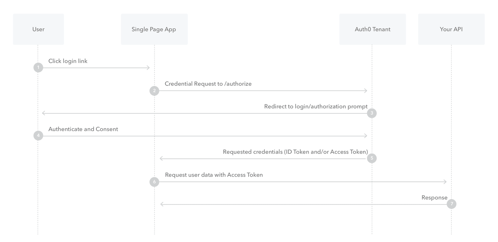

1. Single-Page App Login Flow  

      
    [reference](https://auth0.com/docs/flows/concepts/implicit)  
    [Add Login Using the Implicit Flow](https://auth0.com/docs/flows/guides/implicit/add-login-implicit)  
    [Call API Using the Implicit Flow](https://auth0.com/docs/flows/guides/implicit/call-api-implicit)  
    [React: Login](https://auth0.com/docs/quickstart/spa/react)  
    ```text
    You need to whitelist the URL for your app in the Allowed Web Origins field in your Application Settings. If you don't whitelist your application URL, the application will be unable to automatically refresh the authentication tokens and your users will be logged out the next time they visit the application, or refresh the page.
    ```
    [auth0-spa-js example](https://github.com/auth0-samples/auth0-react-samples)  
    [auth0-spa-js document](https://auth0.github.io/auth0-spa-js/)  
    [auth0-spa-js vs auth0-js](https://github.com/auth0/auth0-spa-js/issues/34)  
