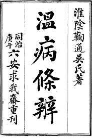
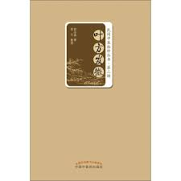
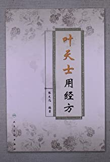

## 引言
学习医案，其中一个内容就是揣测医者选方选药的思路，供自己使用。比如，吴鞠通的《温病条辨》就是整理叶案处方。  
  
近贤俞岳真老先生，研读叶案，有《叶方发微》一书问世。  
  
张文选研究叶氏用经方，出《叶天士用经方》。  
   
从码农的角度看，《温病条辨》和《叶方发微》基本就是把叶氏临证处方列出，选择高频药对，补齐分两，冠一方名，供临床使用。
《叶天士用经方》基本就是选出和叶氏处方接近的经方，从而揣测加减之道。

如果我们可以将处方结构化，应该可以写点代码帮助我们找到高频药对以及相似经方。 嗯，作为一个搬砖工，我整理了下需求。  

## 需求

写一个处方解析器不算太容易，至少不能靠正则表达式。因为需要考虑的情况比第一眼看到的要多一点。比如：

- 可以解析常用格式
  - 单纯中药名  
    `天冬 生地 人参 麦冬 五味`
  - 中药和分量  
     `熟地（四两） 牛膝（一两半） 萸肉（二两） 远志（一两半，炒黑） 杞子（二两） 菊花（二两，炒） 五味（一两半） 川斛（二两四钱） 茯神（二两） 淡苁蓉干（一两二钱）`
  - 中药、分量以及炮制方法等  
     `制首乌（四两，烘） 枸杞子（去蒂，二两） 归身（二两，用独枝者，去梢） 怀牛膝（二两，蒸） 明天麻（二两，面煨） 三角胡麻（二两，打碎，水洗十次，烘） 黄甘菊（三两，水煎汁） 川石斛（四两，水煎汁） 小黑豆皮（四两，煎汁）`  
    `川连（姜汁炒，一两） 枳实（麸炒，二两） 明天麻（二两，煨） 钩藤（三两） 白蒺藜（鸡子黄拌煮，洗净炒，去刺，三两）`  
    `桂枝三两（去皮） 甘草二两（炙） 生姜三两（切） 大枣十二枚（擘） 附子一枚（炮，去皮，破八片） `
  - 药名缩写  
    `赤白苓`
- 扩展性  
  应该可以重用现有的解析器，来支持新的格式。
  - 一个方加减变成另一个方  
    `桂枝加附子汤 即桂枝汤加附子。`  
    `六味地黄丸 即八味去桂附，煎服名六味地黄汤。`
  - 合方  
    `胃苓散 即平胃散合五苓散。`
  - 别名  
    `与崔氏八味丸同。`
  - 处方组成和方名在一起  
    `〔脱症〕理中汤 白术（土炒二两） 人参 炮姜 炙草（各一两） 每服四钱。加附子，名附子理中汤。`  
    `〔呕痰〕异功散 六君子汤除去半夏`  
    `〔阳虚〕八味地黄丸 六味地黄丸加桂心一两，名七味地黄丸，此再加附子一两。`
- 识别疑似中药  
  前人写药名非常随意，并没有统一的格式，中药字典不会包含所有的可能的名字。因此需要解析器稍微智能一点，可以识别一些药名。比如`大黄`，处方名字一般是`生大黄、制大黄、酒大黄、川黄`等等，但是医案里面可能写`韭白汁九制大黄`! 类似的还有：`浙江黄甘菊花炭`、`水炙黑小甘草`、`蜜水炒黄知母`、`徽州黑芝麻`、`活水芦根汁`，例子实在太多，举不完。如果需要人肉把这些名字添到字典里面，相信我，一定会疯:)

## 未完待续
嗯，今天就到这里，等我有时间了，再写续篇，讲怎么实现医案解析器。以及医案解析器的一些副产品，比如
- 医案阅读，每次不显示处方。这样我就有时间想自己的思路了。  
- 经方的加减变化图。前人曾说，伤寒113方都由桂枝汤化出。  
- 对于每个医家，似乎可以找到他的用药风格，以及他弟子的用药风格。（这个我现在还没有太多思路）。  
- 帮组找到医家独特的用药规律（我目前还没有太多思路）。我曾看过一片治崩漏的文章，病机以及辨证分型殊无特殊，唯有在每首示例处方（不论寒热温凉）都有`贯众`，当时猜测`贯众`有止血之用。可惜当时没有找到依据。近来读张志远老先生医著，才知道`贯众可以促进子宫收缩，压迫血管窦，令其闭合，治子宫出血`。

