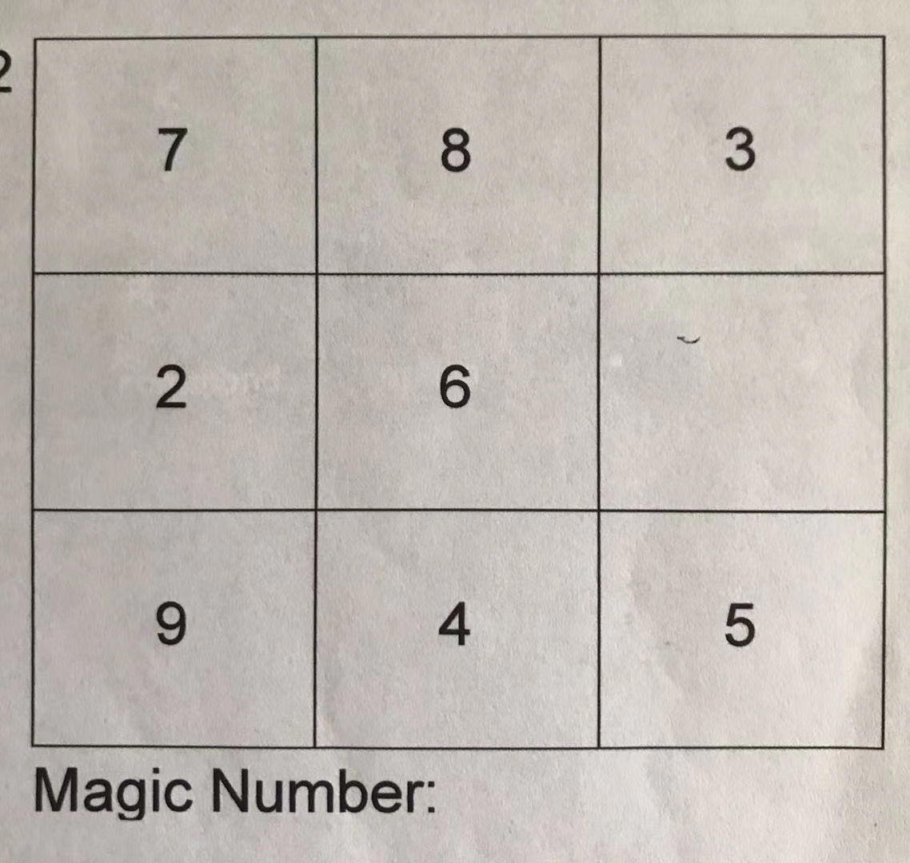
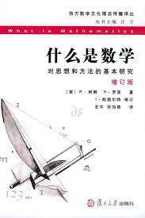

在一个小学数学辅导班的群里面，一个老师发了如下一道题活跃气氛，没有文字说明，只是要求填写magic number。



我第一反应，空白处是1，毕竟这个九宫格，已经包含了2-9这8个数字，就差1了。再算了算行列的和，觉得应该填10，因为每行每列的和是18。有几个家长和我反应一样，给出的答案是10，辅导老师说不对。于是有家长问“magic number"是什么意思，老师没有解释，说就是字面意思，并且提示题目要求填写"magic nubmer"，而不是问该空格应当填数字多少。后面还补充说，她们培训用的教材是M2（我没有找到M2的太多信息，或许在这个老师眼里，M2教材就是数学界的`九阳神功`吧），小朋友很喜欢做这种题目，并且都能答上来。成人因为有定势思维反而做不出来。如果真需要杠的话，做这种题目也不可以破除所谓的定势思维，因为随随便便就可以列出无穷多个数字，符合Magic Number的概念。即使按照参考答案的思路，答案也可以有无穷多种。只需要把加法替换成同余加法，那么任何以18结尾的整数都可以是答案。比如1018就可以是答案，因为九宫格数字之和除1000的余数是18，而1018除1000的余数也是18。

数学大师写了一本《什么是数学》。在这本书里面根本没有提到说学数学要破除思维定势。更多是展示数学除了定义以外的所有结论都需要证明。

  


正因为数学讲究严密的推理，芝诺轻轻放出一只小乌龟就可以引发第二次数学危机，折磨数学家100多年。
```
    阿基里斯是古希腊神话中善跑的英雄。在他和乌龟的竞赛中，他的速度为乌龟的10倍，乌龟在他前面100米起跑，他在后面追，但他不可能追上乌龟。因为在竞赛中，追者首先必须到达被追者的出发点。当阿基里斯追到100米时，乌龟已经又向前爬了10米，于是，一个新的起点产生了；阿基里斯必须继续追，而当他追到乌龟爬的这10米时，乌龟又已经向前爬了1米，阿基里斯只能再追向那个1米。就这样，乌龟会制造出无穷个起点，它总能在起点与自己之间制造出一个距离，不管这个距离有多小，但只要乌龟不停地奋力向前爬，阿基里斯就永远也追不上乌龟！
```
当然，这只小乌龟如果遇到了像我这样的中医爱好者，就威力大减，甚至性命堪忧了。按照《灵枢》经记载，人体有奇经八脉，其中任脉统领一身之阴，督脉统领一身之阳。阳气清轻而升，阴气重浊而下沉，阴阳循环，生生不息。任督二脉，并不是畅通无阻的，所以金庸里面的武侠人士修炼内功的第一步就是要打通任督二脉。本草认为，乌龟长寿任脉常通，所以长寿。龟板熬胶，可以竣补真阴。（梅花）鹿督脉常通，阳气有余，聚而成角。鹿角熬胶，可以竣补真阳。龟板鹿角再加点人参枸杞一起熬胶，就可以阴阳双补，名`龟鹿二仙胶`。

我以前学数学，基本目的不是为了娱乐，主要是为了考试得分。所学内容大致是各种定理和公式，练习题目基本是利用定理和公式去解题。至于这些定理公式产生的背景和实际应用，则知之甚少。甚至学完了微积分，也不知道万有引力定律是怎么弄出来的。如果我去教小学初中数学，会努力把一些证明补齐。比如：
- 为什么乘法会符合交换律？
- 长方形面积为什么是两边相乘，而不是四边相加？推导梯形面积、三角形面积
- 三角形三边各不一样，我们怎么知道每边和高的乘积是相同的？
- 怎么证明勾股定理
- 怎么估算大街上的人数
- 怎么计算根号2
- ....