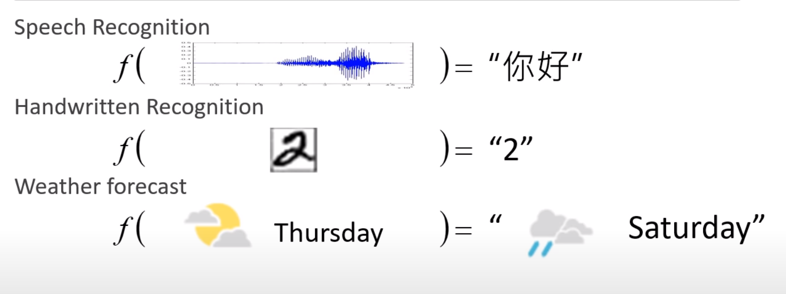
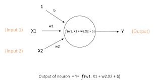
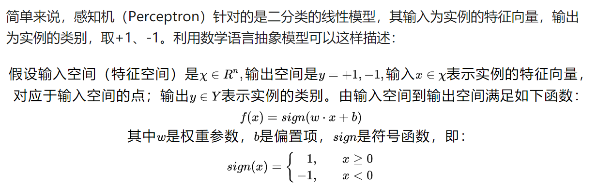
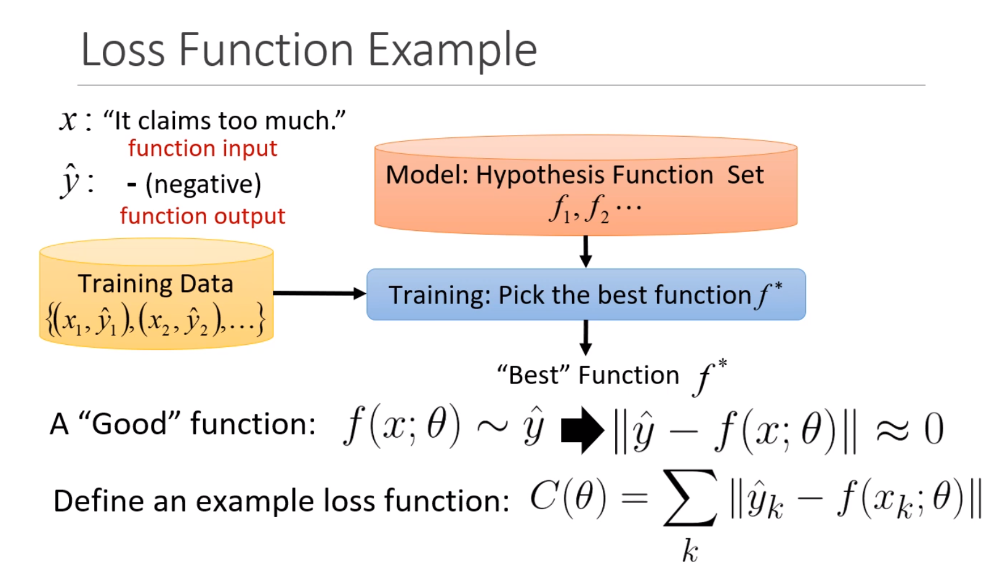
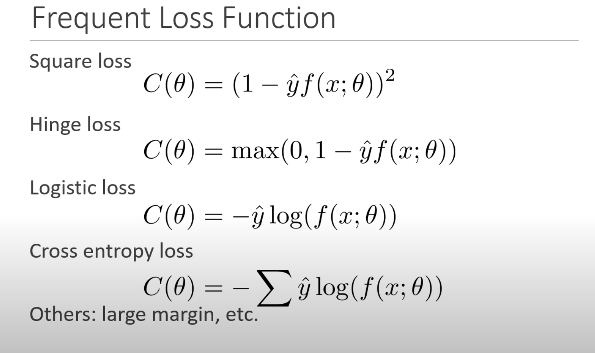

## 什么是机器学习
古圣先贤，觉得我等凡人效率不高，孜孜不倦的探求怎么让机器自己学习成长，最后留给我们一套心法。机器学习就是需要找到一个函数，它可以计算出我们想要的东西。 这个函数的输入可以千差万别，比如语音识别的输入就是声音，手写字识别的输入是图片等等。

至于函数f的类型（模型），又有种种不同。按照训练的方式，可以分成监督学习、无监督学习、半监督学习、增强学习。按照算法，又可以分成SVM，KNN，神经网络等等。

神经网络，是模拟人的大脑而构造出来的，主要由感知机堆积而成。

我们可以看到，每个感知机的输入是向量，输出是一个数字。连接每个感知机连线上的数字w，表示该输入的权重，同时每个神经元还配有偏置b。w和b的数值，就是我们需要计算的参数。一旦这个参数确定好之后，对于任何一个输入向量，我们都可以计算出输出向量。由于组成神经网络的感知机有上亿个，w,b的数值就有上亿个，以至于没有人能够知道最后训练出的模型的数学表达式是什么，只知道怎么训练出比较好用的神经网络。因此，计算参数的过程，俗称`炼丹`。机器学习的第一步就是建立数学模型，怎么把实际问题转换成数学模型，然后一通计算，得到一些好用的结果。

## 怎么判断模型效果
通常，利用损失函数来判断模型得好坏。选定了损失函数之后，通过迭代训练集求得损失函数最小的参数，就是得到一个模型了。

## 结语
机器学习，一共就是三步
1. 将实际输入输出变换成向量
2. 选定模型，调参
3. 把输出向量变换成可读格式
